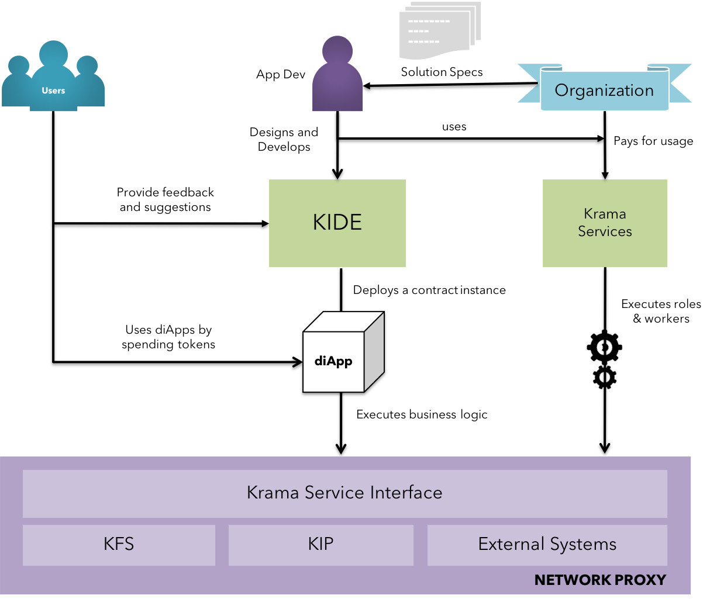
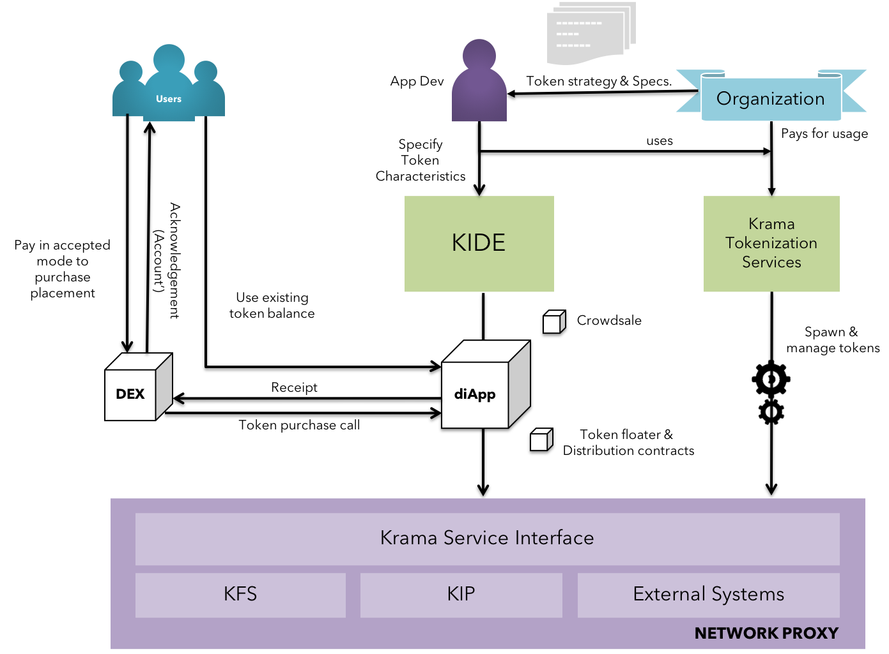
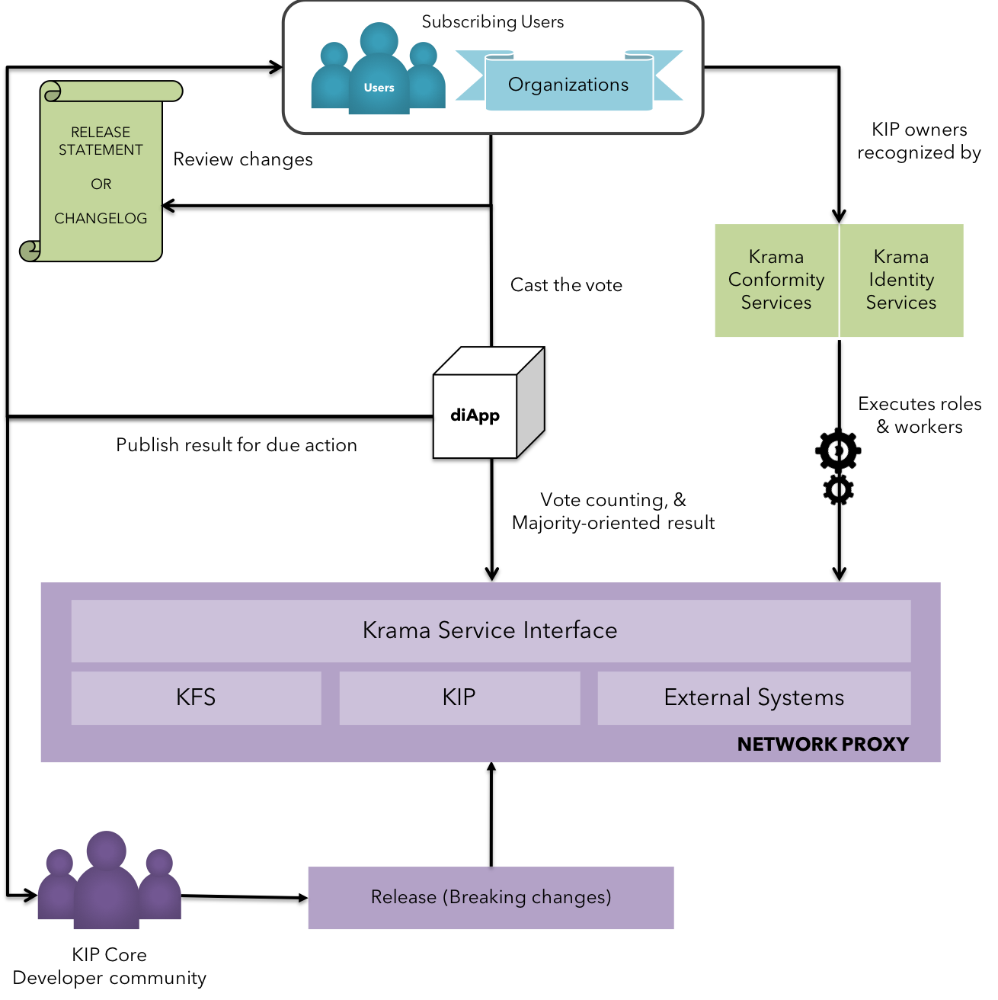

# Enterprise adoption
## Enterprise adoption

### Solution models

KIP offers comprehensive & flexible solution models that favours accelerated adoption for your organization.

KIP also offers a simplistic approach to moving critical components in the business model to be migrated. Continuation of historic data, wherever applicable,can be handled by KIP File System at a relatively cheaper cost and higher availability. Existing diApps on other blockchain platforms compatible with KIP Migration can also practise the same models. (Learn more on *Historical Data Migration* [here](/pages/technical-primer/TechnicalPrimer.md))

  

 <b>Fig 20:</b> Enterprise Adoption - Solution Model

As represented in the figure above, developers can pick up the specifications based on the organization's strategy & be able to convert them into functional logic in code. This is made possible by KIDE(Krama Integrated Development Environment) - A web IDE that offers seamless environment for development, testing & simulation by providing standard 'consumable' libraries that enables the developer to identify, authenticate and manage actors in a diApp space. KIDE is tightly coupled with all the Krama Services such as Identity Services, Krama Tokenization Services, etc. that are subscribed by the developer's organization. (Learn more on *KIDE* [here](/pages/kide/kide-specs.md))

This resulted diApp(distributed intelligent application) is an instance of the code deployed either on KIP's `test-net` or `main-net` by paying a platform fee based on the tier of the nodes used to verify the contract's initiation, inherently a transaction. (Learn more on *Platform Fee* [here](/pages/technical-primer/TechnicalPrimer.md))

diApps developed on KIP shall be upgrade-able, highly available, secure, and scalable along with user-interactive mechanisms to facilitate feedbacks / iterations.

### Financial models

KIP offers a truly decentralized fashion of monetizing assets and solutions in the form of user's subscription to diApp services at a beneficial cost to both parties with lower and predicable interaction fee.

  

 <b>Fig 21:</b> Enterprise Adoption - Financial Model

As depicted in the figure above, developers can float tokens by specifying the nature of the tokens along based on the organization's strategy. This is essentially reflected in a smart contract that spawns tokens in the ecosystem. The characteristics and interface to the tokens are specified in KIDE which is tightly coupled with the Krama Tokenization Service(Learn more on *Krama Tokenization Service* [here](/pages/technical-primer/TechnicalPrimer.md)).

The tokens are integrated to diApps by reference to an address - the adddress of the smart contract deployed through KIDE. This allows the users to spend the tokens to access wide range of services offered by the diApp. Such tokens are used to avail services in the ecosystem and hence treated as *utility tokens*.

The entry to purchase such utility tokens is made possible by DEX(Decentralized Exchange) , an special escrow-like contract run by interested parties to exchange complimentary tokens at a desirable rate and a fee. Users buy relevant tokens necessary by either paying in KIP tokens or by trading one of their other utility tokens. The exchange transactions are mostly immediate, thereby eliminating the synchronous manual efforts needed by the users in comparison to other platforms.

### Governance models

As an enterprise-focused ecosystem, KIP ensures behavioral certainty in the network to the best level possible for frictionless service.

Entities willing to participate as validating nodes in the KIP network need to pass an benchmark / entry test as an onboarding criteria, thereby ensuring a predicted performance before reflecting the KIP's network strength.

Users holding KIP token for a pre-determined amount of time are eligible for vote to changes in the network. This and a set of other criteria ensures the best of interest from users in the ecosystem and reflects the collective responsibility of upholding the network's stability.

  

 <b>Fig 22:</b> Enterprise Adoption - Governance Model

As depicted in the figure above, Users and eligible voters are notified of significant breaking changes that are proposed in the upcoming upgrade of the network. Each voter casts a vote on individual breaking changes with either a 'yay', 'nay' or 'abstain'. Votes pertaining to each breaking change is collected in the *voting booth diApp* and verified. Dependency check is conducted internally on the breaking changes to prevent issues with upgrades when a change is implemented without it's supported dependency feature.

Results are calculated based on the epoch and majority rule inscripted into the *voting booth diApp* , allowing customization wherever required.
The results once computed are published on all relevant channels.
KIP platform shall also equip modern OTA-like patch automation mechanisms to fully decentralize the efforts of changes, driven by multi-sig to ensure proper distribution of power. (Learn more on *breaking changes & release management* [here](/pages/technical-primer/TechnicalPrimer.md)).